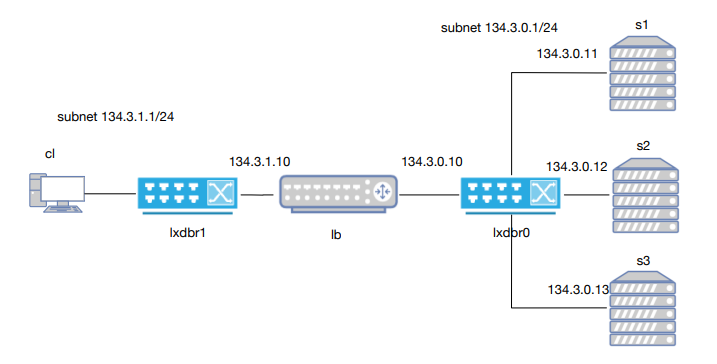

# Proyecto: PRACTICA 1 ARSO

## Descripción

Este proyecto trata de desarrollar una plataforma de despliegue de servidores (Figura 1).



## Requisitos

Para trabajar en este proyecto, asegúrate de tener instalado:

- Git
- Python 3.x

## Instalación

Para descargar el repositorio en tu PC, sigue estos pasos:

```bash
# Clonar el repositorio
git clone https://github.com/javisan17/practica1-arso.git

# Entrar en la carpeta del proyecto
cd practica1_arso

```

## Flujo de trabajo con Git

Para asegurarte de estar trabajando con la última versión del código y poder actualizarlo correctamente, sigue estas indicaciones:

1. **Actualizar el repositorio antes de hacer cambios**

   ```bash
   git pull origin main  # Asegúrate de estar en la rama correcta
   ```

2. **Crear una nueva rama para trabajar en una nueva funcionalidad o corrección**

   ```bash
   git checkout -b nombre_de_la_rama
   ```
    Esto crea una nueva rama y te cambia automáticamente a ella.

3. **Cambiar entre ramas**
   Si ya tienes una rama creada y quieres cambiarte a ella:
   ```bash
   git checkout nombre-de-la-rama
   ```
   Para ver en qué rama estás y las disponibles:
   ```bash
   git branch
   ```

3. **Realizar cambios y guardarlos**

   ```bash
   git add .  # Añadir todos los cambios
   git commit -m "Descripción breve de los cambios"
   ```

4. **Subir los cambios al repositorio**

   ```bash
   git push origin nombre_de_la_rama
   ```

5. **Crear un Pull Request en GitHub**
   - Ir a la página del repositorio en GitHub.
   - Ir a la sección "Pull Requests".
   - Crear un nuevo Pull Request desde tu rama hacia `main`.
   - Esperar revisión y aprobación antes de hacer "merge".

## Contacto

Si tienes dudas o problemas, háblame por WhassApp :).
